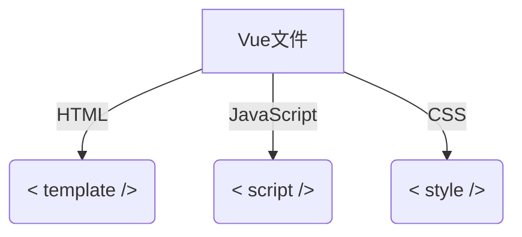

# `Vue.js`框架基础

## `Vue.js `组件




## 安装`Vue.js`

```
sudo cnpm install -g vue-cli
```

## 创建`Vue`项目

```cmd
::使用webpack这套模板去创建vue项目
vue init webpack <你的项目>

::安装所有依赖到当前目录下
cnpm install

```

## 运行项目

```cmd
::项目目录下
npm run dev 
```

## 数据响应式

当vue实例被创建时，它将data对象中的所有property添加到vue响应系统中。

除非使用了Object.freeze()。

## 生命周期

- beforeCreate（初始化）

  > 初始化实例后进行数据侦听和事件/侦听器的配置之前同步调用

- created（初始化）

  > 创建完成后挂在未开始

- beforeMount（初始化）

  > 在挂在开始前被调用，render函数首次被调用

- mounted（初始化）

  > mounted实例可以保证实例被挂在，但不能保证子组件实例被挂载
  > 如果希望保证子组件被挂在mounted内部使用 vm.$nextTick：

- beforeUpdate（更新）

  > 在数据更改导致的虚拟 DOM 重新渲染和更新完毕之后被调用。
  >
  > 这里适合在现有 DOM 将要被更新之前访问它，比如移除手动添加的事件监听器。

- updated（更新）

  > 在数据更改导致的虚拟 DOM 重新渲染和更新完毕之后被调用。

- beforeDestroy（销毁）

  > 实例被销毁前，到这一步，实例依旧可用
  > 该钩子在服务器端渲染期间不被调用。

- destroyed（销毁）

  > 实例销毁后调用。该钩子被调用后，对应 Vue 实例的所有指令都被解绑，
  > 所有的事件监听器被移除，
  > 所有的子实例也都被销毁。
  > 该钩子在服务器端渲染期间不被调用。

- 监听变量变化（watch）（常用）

  

## 模板渲染


> ```html
> <div id=“demo”>
> 	<p>{{message}}<p>
> 	<input v-model="message">
> </div>
> ```
>
> +
>
> ```javascript
> var demo = new Vue{{
>  el:'#demo',
> 	data:{
>      message:'Hello Vue.js!'
>  }
> }}
> ```
>
> =
>
> > `HelloVue.js!`
> >
> > <kbd>Hello Vue.js!</kbd>

注意！！！

这个位置P与input同时为索引引用，当input的内容发生改变时P会同时改变

