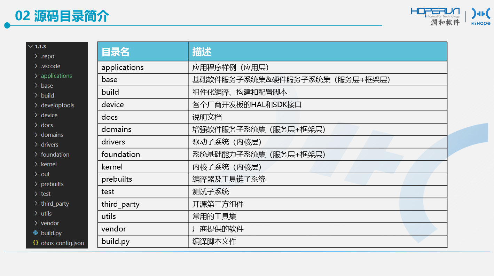
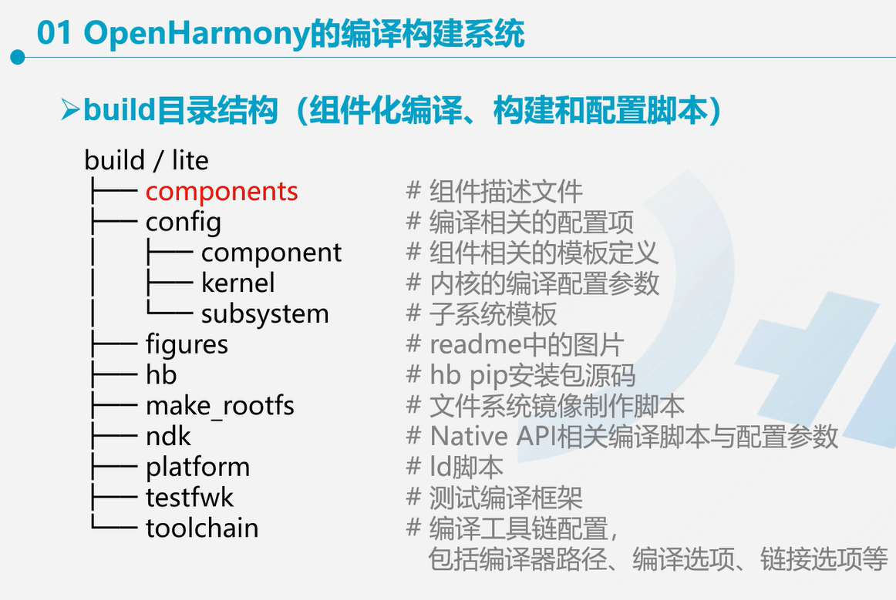
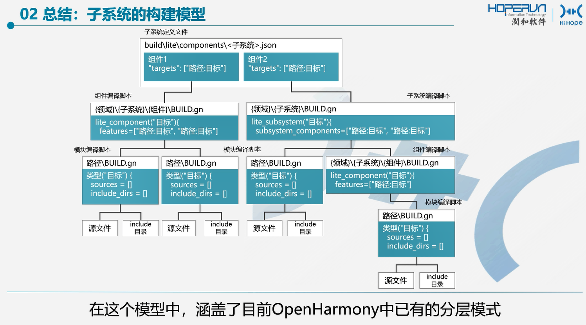

# 润和OpenHarmony智能硬件学习

> 轻量系统（mini system）(L0)
>
> 面向MCU类处理器，例如Arm **Cortex-M**、**RISC-V** 32位，硬件资源极其有限，支持设备最小内存**128KB**，可以提供多种轻量级网络协议，轻量级图形框架，以及丰富的IOT总线读写部件等。
>
> 面向产品：智能家居领域的连接类模组、传感器设备、穿戴类设备等。

```
推荐版本：1.1.3
IoT接口向前兼容到3.1，向后兼容到1.0.1。
Release + LTS。
代码仓不大。
可用版本：1.0.1~3.1
课程所有demo在1.0.1~3.1都可以编译运行。

```

源代码地址[OpenHarmony/manifest (gitee.com)](https://gitee.com/openharmony/manifest)

官网[OpenAtom OpenHarmony](https://www.openharmony.cn/mainPlay)

文档[OpenAtom OpenHarmony](https://docs.openharmony.cn/pages/v3.1/zh-cn/OpenHarmony-Overview_zh.md/)

## 核心板


## 底板





## hb即OHOS Build System

- hb -h：显示帮助
- hb set：设置要编译的产品（目标开发板）
- hb build：增量编译
- hb build -f：全量编译（等同于hb clean + hb build）
- hb clean：清除out目录对应产品的编译产物

```
#安装hb
python3 -m pip install --user ohos-build==0.4.3
```

OpenHarmony编译构建系统





## 轻量系统的数据之久类型


API接口


数据持久化接口列表

```c
#include "kv_store.h"//kv存储接口，键值对
// \utils\native\lite\include\kv_store.h
// \utils\native\lite\kv_store\src\kvstore_impl_hal\kv_store.c


```

## 键值对存储

| **接口名**       | **描述**                   |
| ---------------- | -------------------------- |
| UtilsGetValue    | 根据key获取对应数据项      |
| UtilsSetValue    | 用于存储/更新key对应数据项 |
| UtilsDeleteValue | 删除key对应数据项          |

### 文件存储

| **接口名**      | **描述**                 |
| --------------- | ------------------------ |
| UtilsFileOpen   | 打开或创建文件           |
| UtilsFileClose  | 关闭文件                 |
| UtilsFileRead   | 读取特定长度的文件数据   |
| UtilsFileWrite  | 向文件写入特定大小的数据 |
| UtilsFileDelete | 删除指定文件             |

| **接口****名** | **描述**                         |
| -------------- | -------------------------------- |
| UtilsFileStat  | 获取文件大小                     |
| UtilsFileSeek  | 重新定位文件读/写偏移量          |
| UtilsFileCopy  | 将源文件复制一份并存储到目标文件 |
| UtilsFileMove  | 将源文件移动到指定目标文件       |

•接口的参数和返回值信息可在OpenHarmony源码中获取
